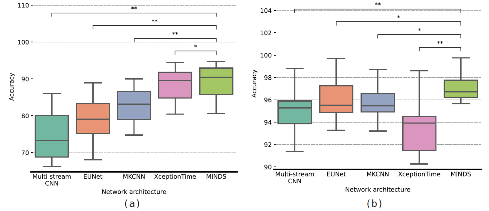

# CMKD-MINDS: Learning an Augmented sEMG Representation via Cross-modality Knowledge Distillation


This is an official pytorch implementation of [Cross Modality Knowledge Distillation between A-mode ultrasound and surface electromyography](https://ieeexplore.ieee.org/document/9845471/)

* Reproduced neural networks for comparison:
  * [x] [Multi Stream CNN(WeiNet)](https://www.sciencedirect.com/science/article/abs/pii/S0167865517304439)
  * [x] [EUNet](https://github.com/increase24/EUNet)
  * [x] [XceptionTime](https://arxiv.org/abs/1911.03803)
  * [x] [Multi-scale Kernel CNN(MKCNN)](https://ieeexplore.ieee.org/document/9495836)

## Environment
The code is developed using python 3.7 on Ubuntu 18.04. NVIDIA GPU is needed.


## Data preparing
The complete hybrid sEMG/AUS dataset is not released now. We apply collected sEMG/AUS data of one subject for code testing, which can be downloaded from: [Baidu Disk](https://pan.baidu.com/s/1qitEFqvwPmD20HnbqgsDcg)
(code: h99k).

Your directory tree should look like this: 
```
${ROOT}/data
├── EMG
|   |—— s1_***_EMG.txt
|   |—— s2_***_EMG.txt
|   |   ...
|   └── s8_***_EMG.txt
└── US
    |—— s1_***_US.txt
    |—— s2_***_US.txt
    |   ...
    └── s8_***_US.txt
```

## Usage
### Installation
1. Clone this repo
2. Install dependencies:
   ```
   pip install -r requirements.txt
   ```
### Training
For training a network on single sEMG or AUS modality, run the script **tools/train.py** with configuration of model and modality. For instance:
```
# train network MINDS on sEMG modality
python ./tools/train.py --config "./configs/USEMG_single.yaml" --modelName "MINDS" --modality "EMG"

# train network EUNet on US modality
python ./tools/train.py --config "./configs/USEMG_single.yaml" --modelName "EUNet" --modality "US"
```
### Evaluation
For validating a network on single sEMG or AUS modality, run the script **tools/test.py** with configuration of model and modality. For instance:
```
# test network MINDS on sEMG modality
python ./tools/test.py --config "./configs/USEMG_single.yaml" --modelName "MINDS" --modality "EMG"

# test network EUNet on US modality
python ./tools/test.py --config "./configs/USEMG_single.yaml" --modelName "EUNet" --modality "US"
```

## Results
|  | 
|:--:| 
| *Figure 1. The accuracy boxplots of five classifiers on two modalities: (a) sEMG modality, (b) AUS modality. The Wilcoxon signed-rank test was applied to compare the proposed network MINDS with other models. The one asterisk "*" and two asterisks "**" denote 0.01 ≤ p < 0.05 and  p < 0.01 respectively.* |

| Model | sEMG(w.o. KD) | sEMG(w. KD) | $H_0$ (p-value)|
| :---: | :---: | :---: | :---: |
| Multi-stream CNN | 74.62 ± 6.68 | 75.48 ± 6.9 | 0 (0.0156)|
| EUNet | 79.59 ± 6.08 | 81.16 ± 6.11 | 0 (0.0078)|
| MKCNN | 82.69 ± 4.94 | 84.59 ± 5.36 | 0 (0.0078)|
| XceptionTime  | 88.30 ± 4.60 | 89.06 ± 4.82 | 0 (0.0234)|
| MINDS (ours)  | 89.05 ± 4.71  | 90.06 ± 4.52 | 0 (0.0078)|
>**The accuracies comparison of sEMG modality with knowledge distillation ("sEMG(KD)") and without knowledge distillation ("sEMG"). The Wilcoxon signed rank test is applied to verify the significance of the improvement obtained by knowledge distillation. The null hypothesis is rejected when $H_0 = 0$ ($p< 0.05$).**


## Citation
If you find this repository useful for your research, please cite with:
```
@article{zeng2022cross,
  title={Cross Modality Knowledge Distillation Between A-Mode Ultrasound and Surface Electromyography},
  author={Zeng, Jia and Sheng, Yixuan and Yang, Yicheng and Zhou, Ziliang and Liu, Honghai},
  journal={IEEE Transactions on Instrumentation and Measurement},
  volume={71},
  pages={1--9},
  year={2022},
  publisher={IEEE}
}
```


## Contact
If you have any questions, feel free to contact me through jia.zeng@sjtu.edu.cn or Github issues.

